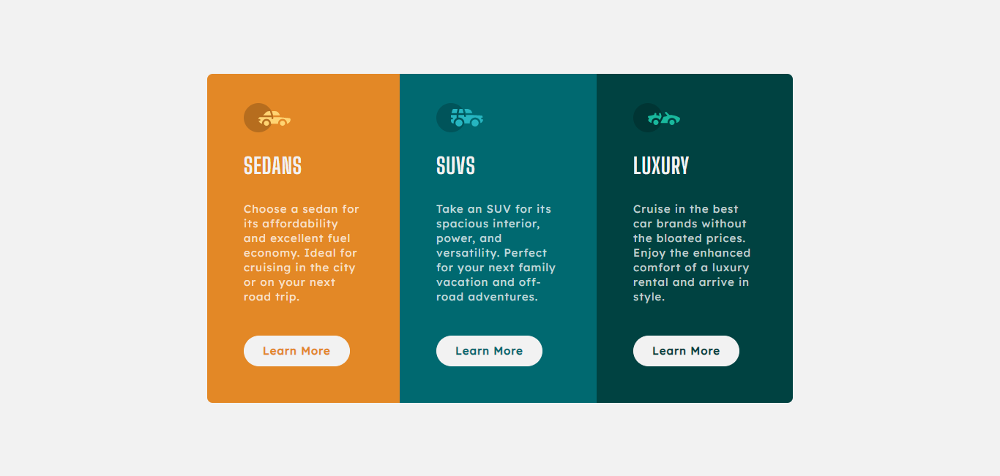
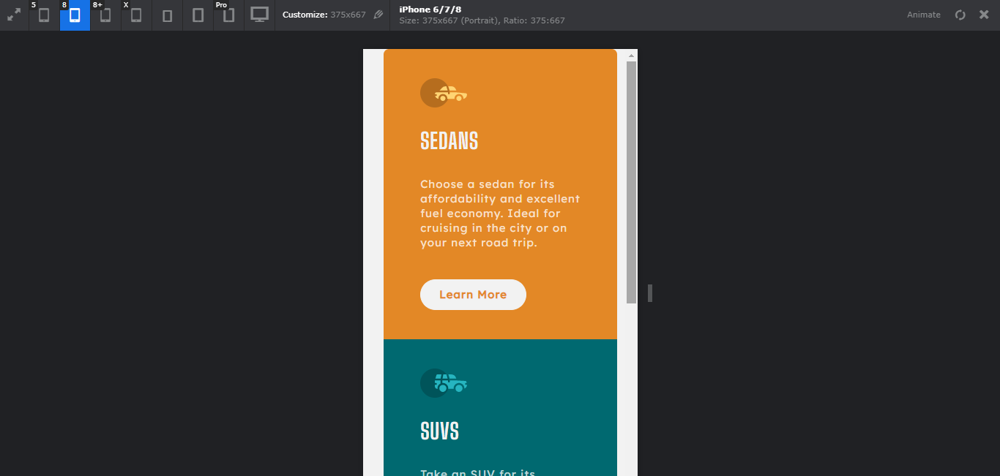
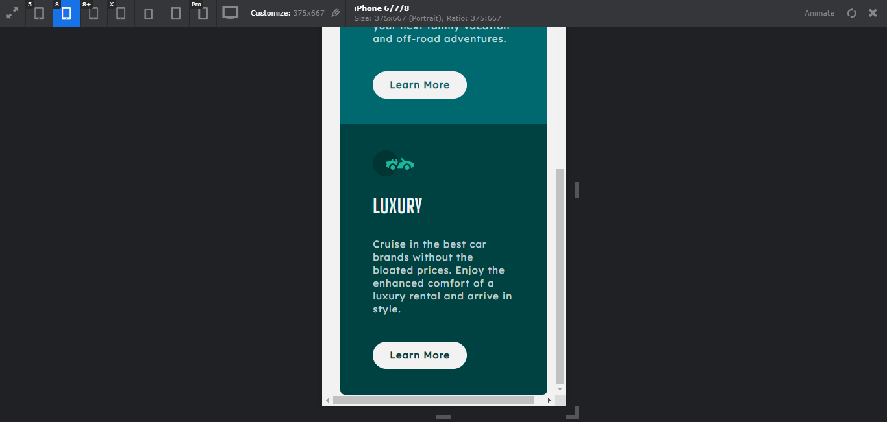

# Frontend Mentor - 3-column preview card component solution

This is a solution to the [3-column preview card component challenge on Frontend Mentor](https://www.frontendmentor.io/challenges/3column-preview-card-component-pH92eAR2-). Frontend Mentor challenges help you improve your coding skills by building realistic projects. 

## Table of contents

- [Overview](#overview)
  - [The challenge](#the-challenge)
  - [Screenshot](#screenshot)
  - [Links](#links)
- [My process](#my-process)
  - [Built with](#built-with)
  - [What I learned](#what-i-learned)
  - [Useful resources](#useful-resources)
- [Author](#author)
- [Acknowledgments](#acknowledgments)


## Overview

### The challenge

Users should be able to:

- View the optimal layout depending on their device's screen size

### Screenshot






### Links

- Solution URL: [https://github.com/hoangnam-nguyen/three-column-preview-card](https://github.com/hoangnam-nguyen/three-column-preview-card)
- Live Site URL: [https://hoangnam-nguyen.github.io/three-column-preview-card/](https://hoangnam-nguyen.github.io/three-column-preview-card/)

## My process

### Built with

- Semantic HTML5 markup
- CSS custom properties
- Flexbox
- Mobile-first workflow


### What I learned

- Fix button position within div: set div to `position: relative`, then set button to `position: absolute` and adjust its position within div using `top, bottom, left, right`.

```css
  .div {
      position: relative;
  }
  
  .btn {
      position: absolute;
      bottom: 5rem;
  }
```

- Avoid vh problem in mobile viewport by creating CSS Custom Properties
```js
// First we get the viewport height and we multiple it by 1% to get a value for a vh unit
let vh = window.innerHeight * 0.01;
// Then we set the value in the --vh custom property to the root of the document
document.documentElement.style.setProperty('--vh', `${vh}px`);
// We listen to the resize event, in case the user rotates the device screen, like from landscape to portrait
window.addEventListener('resize', () => {
    // We execute the same script as before
    let vh = window.innerHeight * 0.01;
    document.documentElement.style.setProperty('--vh', `${vh}px`);
  });
```
```css
div {
    height: 100vh;          /* Fallback for browsers not supporting CSS custom properties */
    height: calc(var(--vh, 1vh) * 100);
}
```


### Useful resources

- [CSS trick to resolve viewport units on mobile](https://css-tricks.com/the-trick-to-viewport-units-on-mobile/) I tried applying this useful trick in this project (although it does not seem really necessary).


## Author

- GitHub - [Nguyen Hoang Nam](https://github.com/hoangnam-nguyen)
- Frontend Mentor - [@hoangnam-nguyen](https://www.frontendmentor.io/profile/hoangnam-nguyen)
- CodePen - [@hoangnam-nguyen](https://codepen.io/hoangnam-nguyen)

## Acknowledgments

Many thanks to [@Joshua](https://www.frontendmentor.io/profile/minimalsm) for his constructive comment, that addresses issues with: lowercase headings, fonts not loading properly and main's width.

